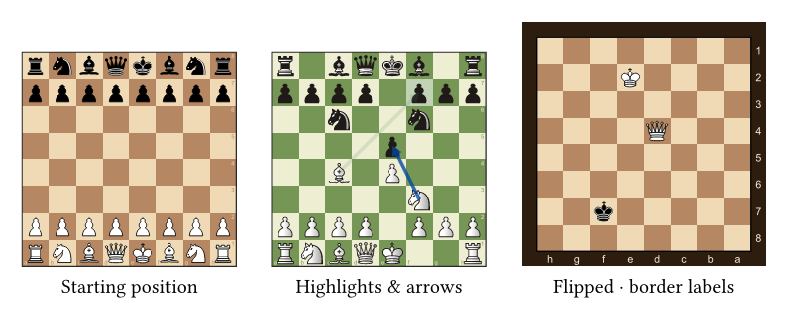

# staunton

A **chess publishing** toolkit for [Typst](https://typst.app): render boards and
pieces, build diagrams from **FEN** or **PGN** (with a pure-Typst legal-move
engine), write localized move **notation**, and generate **tournament tables** —
all as referenceable `#figure`s, with ready-made **outlines** (lists of diagrams
and tables).



## Features

- **Boards & diagrams** from a FEN string, a `position(..)` object, or a manual
  squares dict — captioned `#figure`s with automatic game-info lines.
- **Styling**: themes, six label placements, flip, piece sets, grid, square
  **highlights** (filled / cross / circle) and **arrows**; size-adaptive layout.
- **PGN**: parse multi-game files, navigate the mainline and (nested) variations
  by locator, play "what-if" lines, export FEN. Lazy parsing stays fast on large
  files.
- **Notation**: numbered movetext, figurine glyphs, NAGs, comments, embedded
  diagrams, and **localized piece letters**.
- **Tournament tables**: standings, cross-tables, and progress (player or team),
  with Buchholz / Sonneborn-Berger tie-breaks.
- **Internationalization**: one document language drives supplements, outline
  titles, and notation (en, de, es, fr, it, pt, ru; per-call overridable).
- **References & outlines**: diagrams and tables are figures with distinct kinds,
  so `@label` and dedicated "list of diagrams / tables" outlines just work.

## Quick start

```typ
#import "@preview/staunton:0.1.0": chess-diagram, position, starting-fen

// From a FEN string (this one is 1.e4 c5 2.Nf3):
#chess-diagram("rnbqkbnr/pp1ppppp/8/2p5/4P3/5N2/PPPP1PPP/RNBQKB1R b KQkq - 1 2")

// The starting position, with PGN-style metadata for the caption:
#chess-diagram(starting-fen, white: [Carlsen], black: [Nepo], event: [Dubai], year: 2021)

// Manual placement: a squares dict (square -> piece). Square-name case is
// ignored; pieces may be long names, abbreviations, or bare letters.
#chess-diagram(position((
  e1: (kind: "king", color: "white"),
  e8: (kind: "king", color: "black"),
  e4: "P",                                // bare letter: upper = white pawn
)), labels: false)
```

And from a game:

```typ
#import "@preview/staunton:0.1.0": parse-pgn, board-after, mainline

#let game = parse-pgn(```
[White "Morphy"] [Black "NN"] [Result "1-0"]
1. e4 e5 2. Nf3 d6 3. d4 *
```).first()

#board-after(game, "3w")   // a diagram of the position after White's 3rd move
```

## Documentation

- **User manual** — the complete reference (every function, option, and example),
  with each feature shown as the code you type beside the board it produces.
  Read or download the compiled **[PDF](docs/manual.pdf)**, or build it yourself
  from its Typst source, [`docs/manual.typ`](docs/manual.typ). The manual is part
  of the repo only — it is not shipped in the package bundle.
- **[Showcase](docs/examples/showcase.typ)** — a runnable capability tour.

Compile the manual and the showcase locally with the package folder as root:

```sh
typst compile --root . docs/manual.typ docs/manual.pdf
typst compile --root . docs/examples/showcase.typ showcase.pdf
```

### API at a glance

| area | entry points |
|---|---|
| diagrams | `chess-diagram`, `diagram`, `board`, `chess-board` |
| positions | `position`, `parse-fen`, `to-fen`, `starting-fen` |
| games (PGN) | `parse-pgn`, `movetext`, `mainline`, `board-after`, `position-after`, `play-moves` |
| notation | `chess-notation`, `notation` |
| tables | `standings-table`, `crosstable-table`, `progress-table`, `games-by-event` (+ compute: `standings`, `crosstable`, `progress`) |
| outlines | `chess-diagram-outline`, `chess-table-outline`, `chess-outlines` |
| defaults | `set-chess-defaults`, `set-board-defaults`, `set-diagram-defaults`, `set-table-defaults`, `set-pgn-defaults`, `set-lang`, `set-piece-set` |

## Pieces & licensing

The **code** (`lib.typ`, `src/**/*.typ`) is **MIT**. The bundled **piece SVGs**
are **GPLv2+** — two sets ship: `cburnett` (default, © Colin M.L. Burnett) and
`merida` (© Armando Hernandez Marroquin), from the
[lichess](https://github.com/lichess-org/lila) collection. See [LICENSE](LICENSE)
and [LICENSE-PIECES](LICENSE-PIECES). The package manifest declares
`MIT AND GPL-2.0-or-later`.

A `"unicode"` glyph fallback needs no SVGs. The renderer accepts any set name, so
you can add your own piece set — see the *Pieces and fonts* section of the
[manual](docs/manual.typ).
(Other popular lichess sets carry non-commercial licenses and are not bundled.)

## Repository layout

```
typst.toml          package manifest          LICENSE / LICENSE-PIECES  MIT / GPLv2+
lib.typ             public API + figure wrapper
src/                engine, FEN/PGN/SAN, notation, tournament, board renderer, i18n
src/assets/         piece-set SVGs (cburnett, merida) + i18n language files
docs/manual.typ     user manual (-> PDF)      docs/examples/  runnable showcase
tests/              test suite (bash tests/run.sh)   scripts/  release bundle build
```

## Tests

```sh
bash tests/run.sh        # compiles pass-cases; asserts fail-cases error as expected
```

The runner walks every `.typ` under `tests/`; a file with a `// EXPECT: <substr>`
header must error with that message, any other must compile. Files/dirs prefixed
`_` (shared fixtures) are skipped; `docs/examples/*.typ` are compiled too.

## Roadmap

- More bundled themes / piece sets and an ergonomic API for user-installed sets.
- A move→SAN encoder (so notation can be generated from arbitrary positions).
- Engine performance (the narrow `legal-moves`/`apply` seam can swap to WASM).
- Additional variants (the `position`/board pipeline is variant-aware already).

## License

Code: **MIT** (© 2026 Frank Lippert). Bundled piece images: **GPL-2.0-or-later**.
See [LICENSE](LICENSE) and [LICENSE-PIECES](LICENSE-PIECES).
